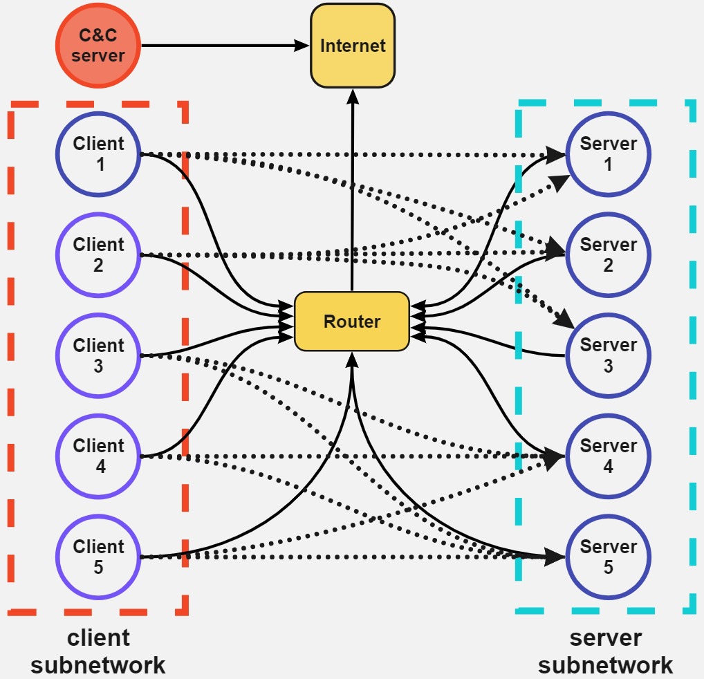
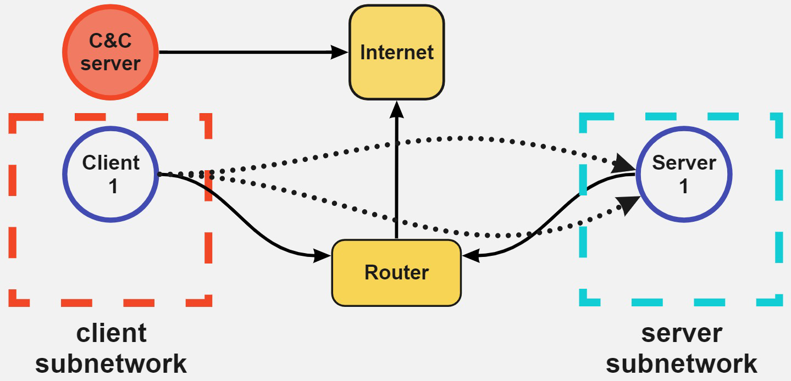
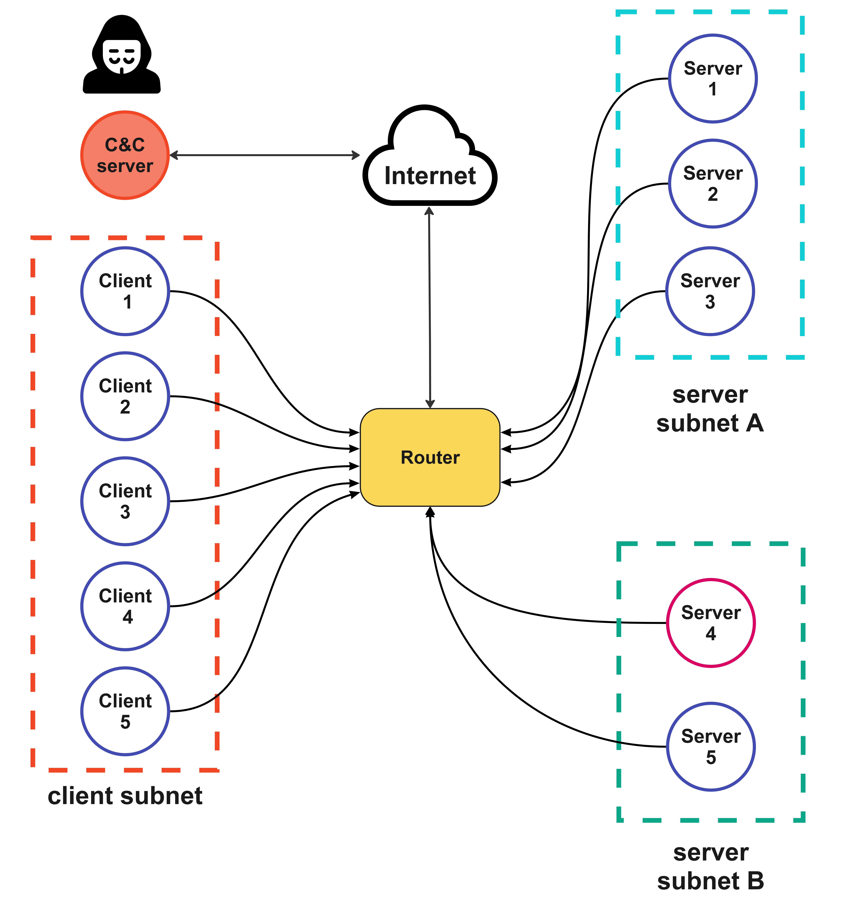

Research Review:

## 1. Paper Information
- ****Title:**** Out of the Cage: How Stochastic Parrots Win in Cyber Security Environments
- ****Authors:**** Maria Rigaki, Ondřej Lukáš, Carlos A. Catania, Sebastian Garcia
- **ArXiv Link:** arXiv:2308.12086v2 [cs.CR]
- **Date of Submission:** 28 Aug 2023
- **Field of Study:** Cybersecurity, Natural Language Processing, Reinforcement Learning
- **Keywords:** reinforcement learning, security games, large language models, planning, network security
- **Code Repository:** https://github.com/stratosphereips/NetSecGame

## 2. Summary
- **Problem Statement:** The paper investigates whether pre-trained large language models (LLMs) can be used as autonomous agents in cybersecurity environments to plan and execute sequential decision-making tasks, such as network penetration testing.
- **Main Contributions:** 
  - Proposes using pre-trained LLMs (e.g., GPT-4, GPT-3.5-turbo) as attackers in network security environments.
  - Introduces a novel simulation environment, NetSecGame, designed around realistic network attack scenarios including a defensive component.
  - Develops different agent architectures (single-prompt, temperature variant, and ReAct agent) and compares their performance against traditional reinforcement learning agents.
- **Key Findings:** 
  - LLM agents, especially those using GPT-4 in a ReAct framework, achieve win rates comparable to or better than classical RL agents trained over thousands of episodes.
  - GPT-4 outperforms GPT-3.5-turbo, though issues such as action repetition and hallucination remain challenges.
- **Methodology Overview:** The authors integrate pre-trained LLMs into two interactive cybersecurity simulator environments (NetSecGame and CyberBattleSim), using carefully engineered prompts and memory strategies to map textual reasoning into valid in-environment actions.
- **Conclusion:** Pre-trained LLMs show promise for high-level planning in complex cybersecurity tasks. However, challenges related to generalization, cost, and stability suggest further research is needed for practical deployment.

## 3. Background & Related Work
- **Prior Work Referenced:** 
  - Transformer and NLP architectures (e.g., GPT-3, GPT-4, BERT)
  - Previous reinforcement learning approaches in simulated cybersecurity environments (e.g., CyberBattleSim, Titan)
  - Frameworks for prompting and planning in LLMs such as Chain-of-Thought, ReAct, and Reflexion.
- **How It Differs from Existing Research:** 
  - Unlike many RL-based approaches that require extensive training episodes, this work leverages pre-trained LLMs for sequential planning without further learning between episodes.
  - The simulation environment is designed to be closer to real-world attack scenarios by incorporating realistic network topologies, randomized targets, and a defender component.
- **Gaps It Addresses:** 
  - Bridging natural language understanding and complex sequential decision-making.
  - Addressing the discrepancy between simple RL task environments and the nuanced nature of cyber attacks.
  - Demonstrating that LLMs, with proper prompt engineering, can effectively replace or complement traditionally trained RL agents.

## 4. Methodology
- **Approach Taken:** The paper embeds pre-trained LLMs into cybersecurity environments as agents, using detailed prompt engineering to convert current state information into well-formatted action commands.
- **Key Techniques Used:** 
  - Single-prompt and multi-stage (ReAct) prompt architectures.
  - Memory strategies to reduce repeated or invalid actions.
  - Temperature tuning for diversifying output when repetition issues occur.
- **Datasets / Benchmarks Used:** Two simulated environments:
  - NetSecGame – a novel environment with realistic network configurations and dynamic goals.
  - CyberBattleSim – specifically its “chain” scenario featuring sequential network penetration tasks.
- **Implementation Details:** 
  - The agents receive textual state descriptions and a set of rules, then output JSON-formatted actions that are parsed and executed within the simulator.
  - The simulation includes a defender module with stochastic detection mechanisms to emulate realistic defensive responses.
- **Reproducibility:** 
  - A code repository for NetSecGame is provided (https://github.com/stratosphereips/NetSecGame), though reliance on commercial LLM APIs (e.g., GPT-4) might affect reproducibility due to model updates and cost constraints.
  - Experimental configurations and prompt examples are detailed in the paper.

## 5. Experimental Evaluation
- **Evaluation Metrics:** 
  - Win rates (successful episode completion)
  - Cumulative returns (reward accumulations)
  - Detection rates (frequency of detection by the defender)
  - Number of steps per episode.
- **Results Summary:** 
  - In the NetSecGame small scenario without a defender, the ReAct agent with GPT-4 achieved a 100% win rate; similar high performance is observed in CyberBattleSim for the chain scenario.
  - LLM-based agents outperformed random and classical Q-learning based agents in many settings.
- **Baseline Comparisons:** 
  - The study compares against a random agent, a random agent with no-repetition heuristics, a Q-learning agent, and a DQN agent in CyberBattleSim.
- **Ablation Studies:** 
  - Variants such as the temperature tuned prompt and memory management strategies were evaluated to tackle action repetition.
- **Limitations Noted by **Authors:**** 
  - The high cost and black-box nature of commercial LLMs (e.g., GPT-4).
  - Issues with hallucination and generation of invalid/repeated actions.
  - Lack of learning across episodes (agents do not update based on past episodes).

## 6. Strengths
- **Novelty & Innovation:** Introduces the innovative concept of using pre-trained LLMs for high-level planning in cybersecurity environments, bypassing the need for extensive RL training.
- **Technical Soundness:** Provides detailed prompt designs, agent architectures, and comparisons with established baselines.
- **Clarity & Organization:** The paper is well-organized, with clear delineation between agent designs, environments, experimental setups, and results.
- **Impact & Potential Applications:** Opens new avenues for using LLMs in autonomous cybersecurity testing, potentially transforming penetration testing and defensive strategy planning.

## 7. Weaknesses & Critiques
- **Unaddressed Assumptions / Flaws:** 
  - The assumption that pre-trained LLMs have sufficient domain-specific knowledge without further fine-tuning may not hold in all contexts.
- **Possible Biases or Limitations:** 
  - Dependence on commercially available LLMs (GPT-4) which are costly and subject to update-induced performance shifts.
- **Reproducibility Concerns:** 
  - Variability of output due to prompt sensitivity and changes in model behavior over time may challenge reproducibility.
- **Presentation Issues:** 
  - Some details of the experimental setup (e.g., defender behavior intricacies) could be further elaborated.

## 8. Future Work & Open Questions
- **Suggested Improvements by **Authors:**** 
  - Integrate a trainable defender module.
  - Develop multi-agent scenarios for richer interactions.
- **Potential Extensions / Further Research Directions:** 
  - Extend the approach to incorporate learning between episodes.
  - Fine-tune open-source LLMs on cybersecurity-specific data to reduce cost and improve performance.
- **Open Problems in the Field:** 
  - How to effectively reduce hallucination and repetition in LLM-generated actions.
  - Balancing cost with performance in real-world applications, and managing prompt sensitivity over time.

## 9. Personal Review & Rating
- **Overall Impression:** 4/5 – The paper presents a novel and promising integration of LLMs with cybersecurity tasks, with practical insights into real-world deployment challenges.
- **Significance of Contributions:** 4/5 – The work has the potential to reshape automated penetration testing and network defense strategies.
- **Clarity & Organization:** 4/5 – Well-structured presentation with detailed experimental evaluations.
- **Methodological Rigor:** 4/5 – Systematic comparisons and thoughtful prompt design bolster the contributions.
- **Reproducibility:** 3/5 – While the provided repository and details are a positive step, reliance on commercial APIs and prompt variability present challenges.

## 10. Additional Notes
- **Key Takeaways:** 
  - Pre-trained LLMs, particularly GPT-4, can serve as effective agents in cybersecurity environments using well-designed prompt strategies.
  - The integration of realistic network simulations (via NetSecGame) provides a valuable testbed for future research.
- **Interesting Insights:** 
  - The work illustrates how minimal additional training (or none at all) is needed when leveraging the capabilities of large language models, provided that the prompt engineering is carefully carried out.
- **Personal Thoughts & Comments:** 
  - This research provides an exciting bridge between natural language processing and cybersecurity, demonstrating that “stochastic parrots” can indeed be strategic agents in complex decision-making scenarios. The model’s performance, despite its noted limitations, suggests significant potential for further exploration in automated penetration testing and adversarial simulations.

-----

Research Review:

#Tags
[[Research/Research Papers/2308.12086v2.pdf]]

## 1. Paper Information
- ****Title:**** Out of the Cage: How Stochastic Parrots Win in Cyber Security Environments
- ****Authors:**** Maria Rigaki, Ondřej Lukáš, Carlos A. Catania, Sebastian Garcia
- **ArXiv Link:** arXiv:2308.12086v2 [cs.CR] (as referenced in the document)
- **Date of Submission:** 2023-08-23
- **Field of Study:** Cybersecurity, Natural Language Processing, Reinforcement Learning
- **Keywords:** reinforcement learning; security games; large language models
- **Code Repository:** https://github.com/stratosphereips/NetSecGame

## 2. Summary
- **Problem Statement:**  
  The paper investigates whether pre-trained Large Language Models (LLMs) can be directly used as agents in cybersecurity environments to perform sequential decision-making, specifically for cybersecurity tasks like penetration testing, without the need for extensive reinforcement learning training.
- **Main Contributions:**  
  • Proposing the use of pre-trained LLMs as attacking agents in cybersecurity scenarios.  
  • Introducing a new, modular, and adaptable network security simulation environment called NetSecGame.  
  • Demonstrating that with appropriate prompt engineering (e.g., single-prompt and ReAct agents), LLMs can achieve performance comparable to or better than state-of-the-art RL agents and human testers.
- **Key Findings:**  
  • GPT-4 based agents (especially with the ReAct architecture) achieve 100% win rates in simplified scenarios and perform competitively in more challenging settings.  
  • The LLM agents can outperform traditional RL agents and even match human performance without additional training across episodes.
- **Methodology Overview:**  
  The authors design agents that interact with cybersecurity simulation environments by parsing the current state into text, using an LLM to propose actions via structured prompts, and incorporating memory strategies to avoid repetitive actions. Experiments are conducted in two environments: the novel NetSecGame and Microsoft’s CyberBattleSim.
- **Conclusion:**  
  Pre-trained LLMs, particularly when used with appropriate prompting frameworks (e.g., ReAct), have the potential to efficiently tackle complex decision-making tasks in cybersecurity without extensive RL training. The approach offers promising avenues for both offensive and defensive cybersecurity applications.

## 3. Background & Related Work
- **Prior Work Referenced:**  
  The paper builds upon transformer architectures (e.g., GPT-3, GPT-4), in-context learning, and chain-of-thought prompting. It also compares with conventional RL methods and previous cybersecurity environments such as CyberBattleSim and Titan.
- **How It Differs from Existing Research:**  
  Unlike traditional RL approaches that require thousands or millions of training episodes, this work leverages pre-trained LLMs directly for high-level planning in cybersecurity tasks. It integrates novel prompt engineering techniques instead of relying solely on vectorized state representations.
- **Gaps It Addresses:**  
  The study addresses the limitation of long training times in RL-based agents and shows how LLMs can use their inherent language understanding and reasoning to plan multi-step attack strategies in simulated network environments.

## 4. Methodology
- **Approach Taken:**  
  The authors employ a two-pronged approach: (1) a single prompt method enhanced with memory for agent decision-making, and (2) a ReAct agent design that interleaves reasoning and action using sequential prompts.
- **Key Techniques Used:**  
  • Memory strategies to avoid action repetition (with temperature adjustments in some variants)  
  • Two-stage prompting (in the ReAct agent) where the LLM first reasons about the state and then selects an action  
  • Integration of the LLM outputs with a cybersecurity simulation API following a reinforcement learning interface.
- **Datasets / Benchmarks Used:**  
  Experiments are conducted in two simulated environments:  
  • NetSecGame (with “small” and “full” scenarios featuring different network topologies)  
  • CyberBattleSim (using a “chain” scenario)
- **Implementation Details:**  
  The agents receive a textual representation of the network state along with historical actions (memory) and a set of rules that mimic realistic cybersecurity constraints. Actions include network scanning, exploiting services, data discovery, and data exfiltration.
- **Reproducibility:**  
  The code for the NetSecGame environment and agent implementations is available at the provided GitHub repository. The paper gives detailed descriptions of prompt structures and environmental configurations to facilitate reproducibility.

## 5. Experimental Evaluation
- **Evaluation Metrics:**  
  Win rates (successful attack completion over total episodes), cumulative return (reward-based scoring), number of steps per episode, and detection rates by defensive mechanisms.
- **Results Summary:**  
  • In the small NetSecGame scenario without a defender, GPT-4 based ReAct agents achieved 100% win rates with optimal step counts.  
  • In scenarios with a defender, while win rates dropped, LLM agents still performed competitively against baselines like Q-learning.  
  • In the CyberBattleSim “chain” scenario, both LLM and DQN agents achieved 100% wins over limited steps.
- **Baseline Comparisons:**  
  Benchmarks include random agents, random agents with no-repeat heuristics, tabular Q-learning agents, and DQN agents.
- **Ablation Studies:**  
  The paper tests different prompt designs (single-prompt vs. ReAct), memory strategies, and temperature variants to mitigate repetitive actions.
- **Limitations Noted by **Authors:****  
  • Occasional hallucination and generation of invalid actions by the LLMs  
  • High cost associated with using GPT-4  
  • Instability and reproducibility issues due to continuous updates in commercial LLMs  
  • No learning carried over between episodes, which could limit adaptation in sustained attacks

## 6. Strengths
- **Novelty & Innovation:**  
  The work is innovative in repurposing pre-trained LLMs for sequential decision-making in cybersecurity without additional training.
- **Technical Soundness:**  
  Detailed prompt engineering and careful integration with simulated environments demonstrate robust technical analysis.
- **Clarity & Organization:**  
  The paper is well-organized with clear descriptions of agent designs, environmental configurations, and experimental protocols.
- **Impact & Potential Applications:**  
  This approach could significantly reduce the time and data required for training cybersecurity agents and has potential applications in automated penetration testing and adversarial defense strategies.

## 7. Weaknesses & Critiques
- **Unaddressed Assumptions / Flaws:**  
  Dependence on state-of-the-art LLMs (e.g., GPT-4) raises questions about scalability and deployment cost in practical settings.
- **Possible Biases or Limitations:**  
  The experimental setups, while sophisticated, remain simulations and may not fully capture the complexities of real-world networks.
- **Reproducibility Concerns:**  
  The use of commercial LLM APIs, which are subject to change and rate limitations, might hinder consistent reproducibility.
- **Presentation Issues:**  
  Some sections regarding prompt design and memory strategies are detailed but could benefit from more quantitative analysis of their individual impact.

## 8. Future Work & Open Questions
- **Suggested Improvements by **Authors:****  
  • Incorporating agents that learn from past episodes by summarizing experiences.  
  • Fine-tuning open-source models to reduce costs and improve specialized performance.
- **Potential Extensions / Further Research Directions:**  
  • Expansion to multi-agent settings and enhanced defender models in NetSecGame.  
  • Integration with real-world emulation systems using virtual machines and actual cybersecurity tools.
- **Open Problems in the Field:**  
  • Addressing LLM hallucinations and repetitive behaviors in sequential decision-making tasks.  
  • Ensuring reproducibility and stability amidst continuous model updates in commercial LLMs.

## 9. Personal Review & Rating
- **Overall Impression:** 4  
- **Significance of Contributions:** 4  
- **Clarity & Organization:** 4  
- **Methodological Rigor:** 4  
- **Reproducibility:** 3

## 10. Additional Notes
- **Key Takeaways:**  
  Pre-trained LLMs, particularly through carefully designed prompt architectures (such as ReAct), can perform complex sequential tasks in cybersecurity scenarios with minimal or no additional training.
- **Interesting Insights:**  
  The use of memory strategies and temperature adjustments illustrates a creative approach to mitigating action repetition and enhancing decision diversity.
- **Personal Thoughts & Comments:**  
  This paper presents a promising paradigm for reducing the extensive training requirements typically associated with RL agents in cybersecurity. Despite the current limitations regarding cost, model drift, and reproducibility, the approach paves the way for further research into integrating language models with autonomous cybersecurity systems.

-----

# Netwrok Security Game
[](https://github.com/stratosphereips/game-states-maker/actions/workflows/python-checks.yml)
[](https://github.com/stratosphereips/game-states-maker/actions/workflows/autotag.yml)

The NetSecGame (Network Security Game) is a framework for training and evaluation of AI agents in the network security tasks (both offensive and defensive). It builds a simulated local network using the [CYST](https://pypi.org/project/cyst/) network simulator, adds many conditions on the environment and can train reinforcement learning (RL) algorithms on how to better attack and defend the network. Examples of implemented agents can be seen in the submodule [NetSecGameAgents](https://github.com/stratosphereips/NetSecGameAgents/tree/main).

The main part of he NetSecGame is the Game coordinator. It creates the enivronemnt, handles the agents and their interactions and coordinates the game(s).

## Installation and Dependencies
To run this code you need an environment and access to cyst code. However, the venv needs to be created for your own user

- If you don't have your environment

```bash
python -m venv ai-dojo-venv-<yourusername>
```

- The environment can be activated with

```bash
source ai-dojo-venv<yourusername>/bin/activate
```

- Install using pip by running following in the **root** directory

```bash
pip install -e .
```

- If you use conda use
```bash
conda create --name aidojo python==3.12
conda activate aidojo
pip install -e .
```

## Components of the NetSecGame Environment
The architecture of the environment can be seen [here](docs/Architecture.md).
The NetSecGame environment has several components in the following files:
```
├── AIDojoGameCoordinator/
|   ├── game_coordinator.py
|	├── game_components.py
|	├── global_defender.py
|	├── worlds/
|		├── NSGCoordinator.py
|		├── NSGRealWorldCoordinator.py
|		├── CYSTCoordinator.py
|	├── scenarios/
|		├── tiny_scenario_configuration.py
|		├── smaller_scenario_configuration.py
|		├── scenario_configuration.py
|		├── three_net_configuration.py
|	├── utils/
|		├── utils.py
|		├── log_parser.py
|		├── gamaplay_graphs.py
|		├── actions_parser.py
```


### Directory Details
- `coordinator.py`: Basic coordinator class. Handles agent communication and coordination. **Does not implement dynamics of the world** and must be extended (see examples in `worlds/`).
- `game_components.py`: Implements a library with objects used in the environment. See [detailed explanation](AIDojoCoordinator/docs/Components.md) of the game components.
- `global_defender.py`: Implements global (omnipresent) defender which can be used to stop agents. Simulation of SIEM.

#### **`worlds/`**
Modules for different world configurations:
- `NSGCoordinator.py`: Coordinator for the Network Security Game.
- `NSGRealWorldCoordinator.py`: Real-world NSG coordinator (actions are executed in the *real network*).
- `CYSTCoordinator.py`: Coordinator for CYST-based simulations (requires CYST running).

#### **`scenarios/`**
Predefined scenario configurations:
- `tiny_scenario_configuration.py`: A minimal example scenario.
- `smaller_scenario_configuration.py`: A compact scenario configuration used for develompent and rapid testing.
- `scenario_configuration.py`: The main scenario configuration.
- `three_net_configuration.py`: Configuration for a three-network scenario. Used for evaluation of the model overfitting.
Implements the network game's configuration of hosts, data, services, and connections. It is taken from [CYST](https://pypi.org/project/cyst/).
#### **`utils/`**
Helper modules:
- `utils.py`: General-purpose utilities.
- `log_parser.py`: Tools for parsing game logs.
- `gamaplay_graphs.py`: Tools for visualizing gameplay data.
- `actions_parser.py`: Parsing and analyzing game actions.

The [scenarios](#definition-of-the-network-topology) define the **topology** of a network (number of hosts, connections, networks, services, data, users, firewall rules, etc.) while the [task-configuration](#task-configuration) is to be used for definition of the exact task for the agent in one of the scenarios (with fix topology).
- Agents compatible with the NetSecGame are located in a separate repository [NetSecGameAgents](https://github.com/stratosphereips/NetSecGameAgents/tree/main)

### Assumptions of the NetSecGame
1. NetSecGame works with the closed-world assumption. Only the defined entities exist in the simulation.
2. If the attacker does a successful action in the same step that the defender successfully detects the action, the priority goes to the defender. The reward is a penalty, and the game ends.
(From commit d6d4ac9, July 18th, 2024, the new action BlockIP removes controlled hosts from the state of others. So the state can get smaller)

- The action FindServices finds the new services in a host. If in a subsequent call to FindServices there are less services, they completely replace the list of previous services found. That is, each list of services is the final one, and no memory of previous open services is retained.

#### Assumption and Conditions for Actions
1. When playing the `ExploitService` action, it is expected that the agent has discovered this service before (by playing `FindServices` in the `target_host` before this action)
2. The `Find Data` action finds all the available data in the host if successful.
3. The `Find Data` action requires ownership of the target host.
4. Playing `ExfiltrateData` requires controlling **BOTH** source and target hosts
5. Playing `Find Services` can be used to discover hosts (if those have any active services)
6. Parameters of `ScanNetwork` and `FindServices` can be chosen arbitrarily (they don't have to be listed in `known_newtworks`/`known_hosts`)
7. The `BlockIP` action needs its three parameters (Source host, Target host, and Blocked host) to be in the controlled list of the Agent. 

> [!NOTE]  
> The global defender, available in the previous environment versions, will not be supported in the future. To enable backward compatibility, the global defender functionality can be enabled by adding `use_global_defender: True` to the configuration YAML file in the `env` section. This option is disabled by default.


#### How the global defender detects

The global defender is implemented as a stochastic detection, which means the detection is probabilistic.

First, all the actions are analyzed in time windows (TW) (default is 5 actions). So the last 5 actions are analyzed together. Every new action moves the slides the TW by one position.


##### Detection Thresholds

- Detection Probabilities

Each action type has a predefined probability of being detected. However, detection does not happen for every action; it depends on additional behavioral patterns.

    - ScanNetwork: 0.05,
    - FindServices: 0.075,
    - ExploitService: 0.1,
    - FindData: 0.025,
    - ExfiltrateData: 0.025,
    - BlockIP: 0.01

This means that one action of the type ScanNetwork has a 5% probability of being detected by the defender. 
This way we can define some basic probabilities based on how good we want the defender to be.

- Type Ratio Threshold

The Type Ratio Threshold defines how frequently an action must appear in the time window to be considered for detection. If the ratio is below this threshold, no detection occurs.

For example, if the last action is ScanNetwork in a TW with [ScanNetwork, FindService, ScanNetwork, FindData, ScanNetwork], the ratio is 3/5 = 0.6

The default values of the thresholds are:

    - ScanNetwork: 0.25,
    - FindServices: 0.3,
    - ExploitService: 0.25,
    - FindData: 0.5,
    - ExfiltrateData: 0.25,
    - BlockIP: 1

- Consecutive Actions Threshold

The Consecutive Actions Threshold determines the maximum number of consecutive occurrences of an action type within the time window before detection is triggered.

The default values of the thresholds are:

    - ScanNetwork: 2,
    - FindServices: 3,
    - ExfiltrateData: 2

- Repeated Action Threshold

The Repeated Action Threshold applies to certain action types and defines the number of times a specific action must appear in the __entire episode__ before it can be considered for detection.

The default values are:

    - ExploitService: 2
    - FindData: 2


##### Decision Logic

The system monitors actions and maintains a history of recent ones within the time window.

- If an action's Type Ratio Threshold is met within the time window or it exceeds the Consecutive Actions Threshold, it is evaluated for detection.

- If the action type has a Repeated Action Threshold and has not been repeated enough times in the episode, it is ignored.

- If an action meets the conditions above, it is subject to detection based on its predefined probability.

- Actions that do not meet any threshold conditions are ignored, ensuring that occasional activity does not lead to unnecessary detections.

This approach ensures that only repeated or excessive behavior is flagged, reducing false positives while maintaining a realistic monitoring system.


## Starting the game
The environment should be created before starting the agents. The properties of the game, the task and the topology can be either read from a local file or via REST request to the GameDashboard.

#### To start the game with local configuration file
```python3 -m AIDojoCoordinator.worlds.NSEGameCoordinator --task_config=<PATH TO CONFIGURATION FILE>```

#### To start the game with remotely defined configuration
```python3 -m AIDojoCoordinator.worlds.CYSTCoordinator --service_host=<URL OF THE REMOTE HOST> --service_port=<PORT FOR THE CONFIGURATION REST API> ```

When created, the environment:
1. reads the configuration file
2. loads the network configuration from the config file
3. reads the defender type from the configuration
4. creates starting position and goal position following the config file
5. starts the game server in a specified address and port

### Interaction with the Environment
When the game server is created, [agents](https://github.com/stratosphereips/NetSecGameAgents/tree/main) connect to it and interact with the environment. In every step of the interaction, agents submits an [Action](./AIDojoCoordinator/docs/Components.md#actions) and receives [Observation](./AIDojoCoordinator/docs/Components.md#observations) with `next_state`, `reward`, `is_terminal`, `end`, and `info` values. Once the terminal state or timeout is reached, no more interaction is possible until the agent asks for a game reset. Each agent should extend the `BaseAgent` class in [agents](https://github.com/stratosphereips/NetSecGameAgents/tree/main).


### Configuration
The NetSecEnv is highly configurable in terms of the properties of the world, tasks, and agent interaction. Modification of the world is done in the YAML configuration file in two main areas:
1. Environment (`env` section) controls the properties of the world (taxonomy of networks, maximum allowed steps per episode, probabilities of action success, etc.)
2. Task configuration defines the agents' properties (starting position, goal)

#### Environment configuration
The environment part defines the properties of the environment for the task (see the example below). In particular:
- `random_seed` - sets seed for any random processes in the environment
- `scenario` - sets the scenario (network topology) used in the task (currently, `scenario1_tiny`, `scenario1_small`, `scenario1` and `three_nets` are available)
- `save_tajectories` - if `True`, interaction of the agents is serialized and stored in a file
- `use_dynamic_addresses` - if `True`, the network and IP addresses defined in `scenario` are randomly changed at the beginning of **EVERY** episode (the network topology is kept as defined in the `scenario`. Relations between networks are kept, IPs inside networks are chosen at random based on the network IP and mask)
- `use_firewall` - if `True` firewall rules defined in `scenario` are used when executing actions. When `False`, the firewall is ignored, and all connections are allowed (Default)
- `use_global_defender` - if `True`, enables global defendr which is part of the environment and can stop interaction of any playing agent.
- `rewards`:
    - `win` - sets reward which agent gets when it reaches the goal (default 100)
    - `loss` - sets the reward that which agent does not reach it's objective (default -10)
    - `step_reward` - sets reward which agent gets for every step taken (default -1)
- `actions` - defines the probability of success for every ActionType

```YAML
env:
    random_seed: 'random'
    scenario: 'scenario1'
    use_global_defender: False
    use_dynamic_addresses: False
    use_firewall: True
    save_trajectories: False
    rewards:
        win: 100
        step: -1
        loss: -10
    actions:
        scan_network:
        prob_success: 1.0
        find_services:
        prob_success: 1.0
        exploit_service:
        prob_success: 1.0
        find_data:
        prob_success: 1.0
        exfiltrate_data:
        prob_success: 1.0
        block_ip:
        prob_success: 1.0
```

#### Task configuration
The task configuration part (section `coordinator[agents]`) defines the starting and goal position of the attacker and the type of defender that is used.

##### Attacker configuration (`[coordinator][agents][Attacker]`)
Configuration of the attacking agents. Consists of three parts:
1. Goal definition (`goal`) which describes the `GameState` properties that must be fulfilled to award `win` reward to the attacker:
    - `known_networks:`(list)
    - `known_hosts`(list)
    - `controlled_hosts`(list)
    - `known_services`(dict)
    - `known_data`(dict)
    - `known_blocks`(dict)

     Each of the parts can be empty (not part of the goal, exactly defined (e.g., `known_networks: [192.168.1.0/24, 192.168.3.0/24]`) or include the keyword `random` (`controlled_hosts: [213.47.23.195, random]`, `known_data: {213.47.23.195: [random]}`.
    Additionally,  if `random` keyword is used in the goal definition, 
    `randomize_goal_every_episode`. If set to `True`, each keyword `random` is replaced with a randomly selected, valid option at the beginning of **EVERY** episode. If set to `False`, randomization is performed only **once** when the environment is 
2. Definition of starting position (`start_position`), which describes the `GameState` in which the attacker starts. It consists of:
    - `known_networks:`(list)
    - `known_hosts`(list)
    - `controlled_hosts`(list)
    - `known_services`(dict)
    - `known_data`(dict)
    - `known_blocks`(dict)

    The initial network configuration must assign at least **one** controlled host to the attacker in the network. Any item in `controlled_hosts` is copied to `known_hosts`, so there is no need to include these in both sets. `known_networks` is also extended with a set of **all** networks accessible from the `controlled_hosts`
3. Definition of maximum allowed amount of steps:
    - `max_steps:`(int): defines the maximum allowed number of steps for attackers in **each** episode.

Example attacker configuration:
```YAML
coordinator:
    agents:
        Attacker:
            max_steps: 20
            goal:
            randomize_goal_every_episode: False
            known_networks: []
            known_hosts: []
            controlled_hosts: []
            known_services: {192.168.1.3: [Local system, lanman server, 10.0.19041, False], 192.168.1.4: [Other system, SMB server, 21.2.39421, False]}
            known_data: {213.47.23.195: ["random"]}
            known_blocks: {'all_routers': 'all_attackers'}

            start_position:
            known_networks: []
            known_hosts: []
            # The attacker must always at least control the CC if the goal is to exfiltrate there
            # Example of fixing the starting point of the agent in a local host
            controlled_hosts: [213.47.23.195, random]
            # Services are defined as a target host where the service must be, and then a description in the form 'name, type, version, is_local'
            known_services: {}
            known_data: {}
            known_blocks: {}
```

##### Defender configuration (`[coordinator][agents][Defender]`)
Currently, the defender **is** a separate agent.

If you want a defender in the game, you must connect a defender agent. For playing without a defender, leave the section empty.

Example of defender configuration:
```YAML
   Defender:
      goal:
        description: "Block all attackers"
        known_networks: []
        known_hosts: []
        controlled_hosts: []
        known_services: {}
        known_data: {}
        known_blocks: {}

      start_position:
        known_networks: []
        known_hosts: []
        controlled_hosts: [all_local]
        known_services: {}
        known_data: {}
        blocked_ips: {}
        known_blocks: {}
```
As in other agents, the description is only a text for the agent, so it can know what is supposed to do to win. In the curent implementation, the *Defender* wins, if **NO ATTACKER** reaches their goal. 


### Definition of the network topology
The network topology and rules are defined using a [CYST](https://pypi.org/project/cyst/) simulator configuration. Cyst defines a complex network configuration, and this environment does not use all Cyst features for now. CYST components currently used are:

- Server hosts (are a NodeConf in CYST)
    - Interfaces, each with one IP address
    - Users that can log in to the host
    - Active and passive services
    - Data in the server
    - To which network is connected
- Client host (are a Node in CYST)
    - Interfaces, each with one IP address
    - To which network is connected
    - Active and passive services if any
    - Data in the client
- Router (are a RouterConf in CYST)
    - Interfaces, each with one IP address
    - Networks
    - Allowed connections between hosts
- Internet host (as an external router) (are a Node in RouterConf)
    - Interfaces, each with one IP address
    - Which host can connect
- Exploits
    - which service is the exploit linked to

### Scenarios
In the current state, we support a single scenario: Data exfiltration to a remote C&C server. However, extensions can be made by modification of the task configuration.

#### Data exfiltration to a remote C&C
For the data exfiltration we support 3 variants. The full scenario contains 5 clients (where the attacker can start) and 5 servers where the data that is supposed to be exfiltrated can be located. *scenario1_small* is a variant with a single client (the attacker always starts there) and all 5 servers. *scenario1_tiny* contains only a single server with data. The tiny scenario is trivial and intended only for debugging purposes.
<table>
  <tr><th>Scenario 1</th><th>Scenario 1 - small</th><th>Scenario 1 -tiny</th></tr>
  <tr><td></td><td><td></td></tr>
  <tr><th>3-nets scenario</th></tr>
  <tr>
    <td>
       
    </td>
  </tr>
</table>

### Trajectory storing and analysis
The trajectory is a sequence of GameStates, Actions, and rewards in one run of a game. It contains the complete information of the actions played by the agent, the rewards observed and their effect on the state of the environment. Trajectory visualization and analysis tools are described in [Trajectory analysis tools](./docs/Trajectory_analysis.md)

Trajectories performed by the agents can be stored in a file using the following configuration:
```YAML
env:
  save_trajectories: True
```
> [!CAUTION]
> Trajectory files can grow very fast. It is recommended to use this feature on evaluation/testing runs only. By default, this feature is not enabled.

## Testing the environment

It is advised after every change you test if the env is running correctly by doing

```bash
tests/run_all_tests.sh
```
This will load and run the unit tests in the `tests` folder. 

## Code adaptation for new configurations
The code can be adapted to new configurations of games and for new agents. See [Agent repository](https://github.com/stratosphereips/NetSecGameAgents/tree/main) for more details.

## About us
This code was developed at the [Stratosphere Laboratory at the Czech Technical University in Prague](https://www.stratosphereips.org/).


-----

Research Review:

#Tags
[[Research/Research Papers/2308.12086v2.pdf]]

## 1. Paper Information
- ****Title:**** Out of the Cage: How Stochastic Parrots Win in Cyber Security Environments
- ****Authors:**** Maria Rigaki, Ondřej Lukáš, Carlos A. Catania, Sebastian Garcia
- **ArXiv Link:** https://arxiv.org/abs/2308.12086v2
- **Date of Submission:** August 2023 (v2 submitted on 28 Aug 2023)
- **Field of Study:** Cybersecurity, Reinforcement Learning, Natural Language Processing
- **Keywords:** reinforcement learning, security games, large language models, sequential decision-making, cyber security
- **Code Repository:** https://github.com/stratosphereips/NetSecGame

## 2. Summary
- **Problem Statement:**  
  The paper investigates whether pre-trained large language models (LLMs) can be leveraged as autonomous agents to perform sequential decision-making in cybersecurity network environments, potentially matching or outperforming classical reinforcement learning agents that require extensive training.
- **Main Contributions:**  
  • Proposing the use of pre-trained LLMs as agents in cybersecurity scenarios without additional training.  
  • Introducing a novel, modular network security reinforcement learning environment named NetSecGame.  
  • Demonstrating that LLM agents (especially when using the ReAct framework) can achieve win rates similar to or better than traditional RL agents and even human testers in simulated red-team scenarios.
- **Key Findings:**  
  • LLM-based agents—particularly those based on GPT-4 using the ReAct design—can achieve high win rates in both the NetSecGame and CyberBattleSim environments.  
  • In scenarios without adversarial defenders, the LLM agents achieved 100% win rates with as few as 60 steps, while even in the presence of defenders, they performed competitively against baseline RL agents.  
  • The gap between performance with GPT-3.5-turbo and GPT-4 was significant, with GPT-4 showing higher stability and better planning capabilities.
- **Methodology Overview:**  
  The study evaluates LLM agents using two simulation environments (NetSecGame and CyberBattleSim). The researchers design agent prompts (single-prompt and a two-stage ReAct framework) and compare their performance against standard baselines such as random agents and Q-learning-based agents, with experiments varying in scenario complexity, step limitations, and the presence/absence of defenders.
- **Conclusion:**  
  Pre-trained LLMs show promising potential for planning and executing complex cybersecurity attacks in simulated environments. Although they bring advantages like lower training requirements, limitations such as cost, hallucination, and reproducibility issues must be addressed in future work.

## 3. Background & Related Work
- **Prior Work Referenced:**  
  The paper builds upon classic reinforcement learning frameworks, transformer architectures, early LLM studies (e.g., GPT-3, Chain-of-Thought prompting), and recent advancements in prompting techniques (ReAct, Reflexion, and DEPS) as well as prior cybersecurity RL environments like CyberBattleSim.
- **How It Differs from Existing Research:**  
  Unlike previous approaches that require thousands or millions of training episodes, this paper uses pre-trained LLMs with prompt engineering to directly handle sequential decision-making tasks in network security without further fine-tuning. The introduction of a more realistic simulation environment with dynamic objectives and stochastic defender behavior also distinguishes this work.
- **Gaps It Addresses:**  
  The study addresses the challenge of long-term planning in cybersecurity using LLMs, bypassing the need for extensive training data and heavy tuning, and it attempts to bridge the gap between language understanding and effective sequential decision-making in an adversarial setting.

## 4. Methodology
- **Approach Taken:**  
  The authors employ pre-trained LLMs as agents that interact with simulation environments by receiving a textual state representation and outputting actions in a specific JSON format. Two prompt-based agent designs are considered: a single-prompt agent and a two-stage ReAct agent.
- **Key Techniques Used:**  
  • Prompt engineering including memory components (to avoid repetition and encourage diverse actions).  
  • The ReAct framework to combine reasoning and actionable responses.  
  • Comparative simulation experiments in varied cybersecurity scenarios that include different network topologies and the presence of a defender.
- **Datasets / Benchmarks Used:**  
  The environments used (NetSecGame and CyberBattleSim) serve as benchmarks, each simulating different aspects of real-world network attacks with configurable topology, action success probabilities, and defender behavior.
- **Implementation Details:**  
  NetSecGame is a modular RL environment defined by configuration files detailing network topology, action and state space definitions, rewards, and a stochastic threshold-based defender. The agents are implemented via Python APIs which interact with the environments and process state feedback.
- **Reproducibility:**  
  A code repository is provided (https://github.com/stratosphereips/NetSecGame), facilitating experiment reproduction; however, some challenges remain due to reliance on commercial LLMs (e.g., GPT-4) which may introduce reproducibility issues stemming from rate limitations and model updates.

## 5. Experimental Evaluation
- **Evaluation Metrics:**  
  Win rates (percentage of episodes solved), average returns (cumulative rewards), detection rates (in scenarios with a defender), and the number of steps per episode.
- **Results Summary:**  
  The ReAct agent with GPT-4 achieved 100% win rates in less complex (or no defender) scenarios and maintained competitive performance even with defenders present. In CyberBattleSim’s chain scenario, both DQN and LLM agents solved the environment with optimal or near-optimal steps.
- **Baseline Comparisons:**  
  The LLM agents were compared with random agents (with and without a no-repeat heuristic) and reinforcement learning agents like Q-learning and Deep Q-learning Networks (DQN), with LLM agents outperforming several baselines in many scenarios.
- **Ablation Studies:**  
  The paper demonstrates differences in performance between single-prompt vs. ReAct prompting strategies and between GPT-3.5-turbo and GPT-4 based implementations.
- **Limitations Noted by **Authors:****  
  • Issues with hallucination and action repetition in lower-tier models.  
  • The high cost of using GPT-4 API compared to GPT-3.5.  
  • Reproducibility concerns because of model drift and rapid changes in commercial LLMs.  
  • The agents do not currently learn from episode to episode as they restart each scenario from scratch.

## 6. Strengths
- **Novelty & Innovation:**  
  Proposing a new use case for pre-trained LLMs in cybersecurity decision-making and introducing NetSecGame as a realistic simulation environment.
- **Technical Soundness:**  
  The experiments are well-structured with thorough comparisons against established RL baselines, and the integration of real-world constraints (like a defender) adds practical relevance.
- **Clarity & Organization:**  
  The paper is organized with clear sections on methodology, experimentation, and a detailed description of prompt structures.
- **Impact & Potential Applications:**  
  The approach suggests that LLMs can reduce training times in cybersecurity applications and may be a stepping stone towards autonomous penetration testing and proactive cyber defense systems.

## 7. Weaknesses & Critiques
- **Unaddressed Assumptions / Flaws:**  
  The agents assume a static or non-learning setup per episode; there is no inter-episode memory or learning, which might limit long-term strategic improvements.
- **Possible Biases or Limitations:**  
  Dependence on commercial models like GPT-4 poses cost and reproducibility issues. Additionally, the experimental environments, while realistic, are still simulations and may not capture the full complexity of real-world networks.
- **Reproducibility Concerns:**  
  Variability in commercial LLM performance, API rate limitations, and prompt sensitivity can hinder consistent reproduction of results.
- **Presentation Issues:**  
  Some aspects such as prompt engineering details and hyperparameter choices could be more explicitly detailed to further support reproducibility.

## 8. Future Work & Open Questions
- **Suggested Improvements by **Authors:****  
  Incorporation of learnable components to allow agents to adapt their strategy across episodes and integration of a trainable defender for richer adversarial dynamics.
- **Potential Extensions / Further Research Directions:**  
  Fine-tuning open-source LLMs for cybersecurity tasks, developing multi-agent cooperative or adversarial scenarios, and testing in more emulated or real network setups.
- **Open Problems in the Field:**  
  Addressing LLM hallucination in sequential decision-making contexts, cost optimization for using high-performing LLMs, and creating robust evaluation metrics for autonomous cyber agents in evolving threat landscapes.

## 9. Personal Review & Rating
- **Overall Impression:** 4/5  
- **Significance of Contributions:** 4/5  
- **Clarity & Organization:** 4/5  
- **Methodological Rigor:** 4/5  
- **Reproducibility:** 3/5

## 10. Additional Notes
- **Key Takeaways:**  
  The paper successfully demonstrates that pre-trained LLMs, with careful prompt engineering, can perform complex sequential tasks in cybersecurity environments and work competitively with traditional RL agents.
- **Interesting Insights:**  
  The employment of the ReAct framework and dynamic memory components in the agent prompts is a promising route to mitigate issues like repetitive actions and sub-optimal navigation in state space.
- **Personal Thoughts & Comments:**  
  This work bridges natural language processing and cybersecurity, showing a novel application of LLMs beyond text generation. While there are challenges related to cost and reproducibility, the methodology opens up exciting avenues for autonomous cyber defense and penetration testing tools.